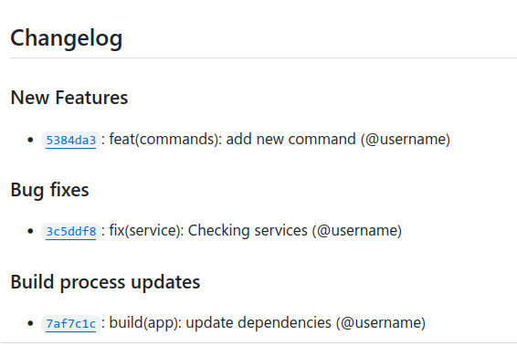

[](LICENSE)
[](https://github.com/varrcan/generate-pretty-changelog-action/commits)
[](https://github.com/varrcan/generate-pretty-changelog-action/releases)

# ✏️ Generate Pretty Changelog

Automatically generate changelog from your pull requests on GitHub.

This action also makes the changelog file `CHANGELOG.md` and available to other actions as [output](#outputs).

## Example usage

```yaml
name: Changelog
on:
  push:
    tags:
      - "*"
jobs:
  release:
    runs-on: ubuntu-latest
    steps:
      - name: Checkout
        uses: actions/checkout@v3
      - name: Generate release changelog
        uses: varrcan/generate-pretty-changelog-action@v1
        with:
          config: .github/changelog.yaml # Use custom config file (optional)
      - name: Release
        uses: softprops/action-gh-release@v1
        with:
          body_path: CHANGELOG.md
```

## Sample changelog



## Inputs

| Name     | Description                                             | Required | Default                       |
|----------|---------------------------------------------------------|----------|-------------------------------|
| `use`    | Changelog generation implementation (`github` or `git`) | no       | `github`                      |
| `config` | Use custom config file                                  | no       | `changelog.yaml`              |
| `token`  | GitHub token (only required if github type is selected) | no       | `${{ secrets.GITHUB_TOKEN }}` |

## Outputs

| Name        | Description                       |
|-------------|-----------------------------------|
| `changelog` | Contents of generated change log. |

## Config file

`changelog.yaml` is a [YAML](https://yaml.org/) file with the following structure:

```yaml
changelog:
  sort: asc
  use: github
  filters:
    exclude:
      - '^test:'
      - '^chore'
      - 'merge conflict'
      - Merge pull request
      - Merge remote-tracking branch
      - Merge branch
      - go mod tidy
  groups:
    - title: 'New Features'
      regexp: '^.*?feat(\([[:word:]]+\))??!?:.+$'
      order: 100
    - title: 'Security updates'
      regexp: '^.*?sec(\([[:word:]]+\))??!?:.+$'
      order: 150
    - title: 'Bug fixes'
      regexp: '^.*?fix(\([[:word:]]+\))??!?:.+$'
      order: 200
    - title: Dependency updates
      regexp: '^.*?(feat|fix)\(deps\)!?:.+$'
      order: 300
    - title: 'Documentation updates'
      regexp: ^.*?doc(\([[:word:]]+\))??!?:.+$
      order: 400
    - title: 'Build process updates'
      regexp: ^.*?build(\([[:word:]]+\))??!?:.+$
      order: 500
    - title: Other work
      order: 9999

```
